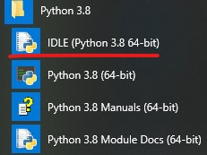
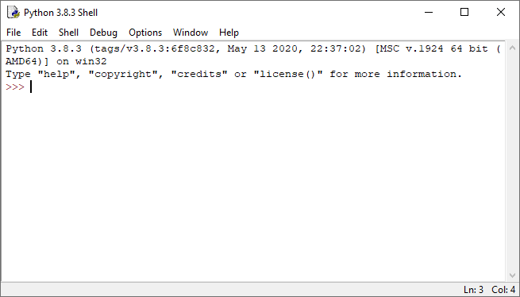

# 2 - Instalación del lenguaje y pasos para crear nuestro primer programa

1. Para la descargar 🔽 Python lo hacemos del sitio: [python.org](https://www.python.org/downloads/) \(descargar la versión más actual 3.8 en adelante\) 
2. Ejecutamos el programa que descargamos y procedemos a instalarlo \(marcamos 'Add Python3.8 to PATH'\) 
3. Luego de haberse instalado podemos ejecutarlo desde el menú de opciones de Windows:

 Una vez que iniciamos la IDLE de Python aparece la siguiente ventana:

Para crear nuestro primer programa debemos 😀 :

1. seleccionar desde el menú de opciones "File"-&gt;"New File"
2. En esta nueva ventana debemos codificar nuestro programa en Python \(ejm print\("Hello world"\)\).
3. Guardar el programa en  Python seleccionando la opción "File"-&gt;"Save".
4. Luego en la misma ventana desde la ventana de nuestro editor la opción "Run" -&gt; "Run Module"
5.  Hemos Ejecutado nuestro primer programa 😊 

### Nota: 

El editor que viene por defecto en Python  es muy limitado 😶 ,  recomiendo  los editores 🗂 :

* [VS Code](https://code.visualstudio.com/) \(instalando la extension Python\) 🔛 [ Tutorial](https://www.youtube.com/watch?v=9Hh6fqieReE)
* [PyCharm](https://www.jetbrains.com/es-es/pycharm/) 🔛 [Tutorial](http://programacion.espol.edu.ec/%23/gu%C3%ADas-de-instalaci%C3%B3n/instalaci%C3%B3n-de-pycharm/)
* [Jupyter](https://www.anaconda.com/products/individual) \(con anaconda\) 🔛 [Tutorial](https://www.youtube.com/watch?v=-gOZhQcKxs8)

 

