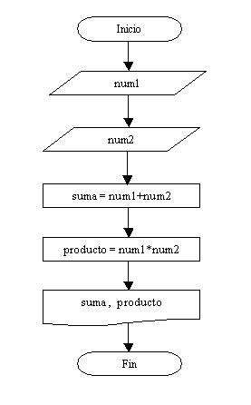

# 5 - Estructura de programación secuencial

Cuando en un problema sólo participan operaciones, entradas y salidas se la denomina una estructura secuencial.  
Los problemas diagramados y codificados previamente emplean solo estructuras secuenciales.

La programación requiere una práctica ininterrumpida de diagramación y codificación de problemas.

### Ejemplos

#### Ejemplo 1

Realizar la carga de dos números enteros por teclado ⌨ e imprimir su suma y su producto.



Tenemos dos entradas numero1 y numero2, dos operaciones: la suma y el producto de los valores ingresados y dos salidas, que son los resultados de la suma y el producto de los valores ingresados. 

En el símbolo de imprsión 🖨 podemos indicar una o más salidas, eso queda a criterio del programador, lo mismo para indicar las entradas por teclado.

```python
number1 = int(input("enter number1: "))
number2 = int(input("enter number2: "))
sum = number1+number2
multiplication = number1 + number2
print("The sum is: ", sum)
print("The multiplication is: ", multiplication)
```

#### Ejemplo 2

Realizar la carga del precio 💸 de un producto por teclado y la cantidad de artículos a llevar del mismo producto 🛒 . Mostrar cuanto se debe pagar \(se ingresa un valor entero en el precio del producto\)


Tenemos dos entradas 💻 : precio y cantidad, una operación para calcular el importe 💳 \(precio a pagar\) y una salida.

```python
articulo = int (input ("ingrese el precio de un articulo: $"))
cantidad = int(input("ingrese la cantidad de articulos: "))
precio = articulo*cantidad
print('El precio es: $', precio)
```

### Problemas propuestos 📚 


Ha llegado una parte fundamental 😀 , que es el momento donde uno desarrolla individualmente un algoritmo ✍🏾 para la resolución de problemas. El tiempo a dedicar a esta **sección ejercicios propuestos** 👩🏾💻 debe ser mucho mayor que el empleado a la sección de **ejercicios resueltos**.  
 La _experiencia_ dice que debemos dedicar el 80% del tiempo 🕖 a la resolución _individual_ de problemas y el otro 20% al análisis y codificación de problemas ya resueltos 🗃 por otras personas.  
 ⚠ Es de vital importancia para llegar a ser un buen programador poder resolver problemas en forma individual. 💪🏾


#### Problema 1

Realizar la carga del lado de un cuadrado, mostrar por pantalla el perímetro del mismo \(El perímetro de un cuadrado se calcula multiplicando el valor del lado por cuatro\) 

#### Problema 3

Escribir un programa en el cual se ingresen cuatro números, calcular e informar la suma de los dos primeros y el producto del tercero y el cuarto.

#### Problema 4

Realizar un programa que lea cuatro valores numéricos e informar su suma y promedio.

#### Problema 5

Calcular el sueldo mensual de un operario conociendo la cantidad de horas trabajadas y el valor por hora.

#### Solución 🆘 


**Nota :** 👩🏫 Inténtalo tu mism@, esta es la mejor forma de aprender 📈  o si quieres ver 👀 otro algoritmo para solucionar el mismo problema. 👨💻 




```python
side = int (input("Enter side: "));
perimeter=side*4
print ("perimeter is: ",perimeter)
```



```python
number1=int(input("Enter number1:"))
number2=int(input("Enter number2:"))
number3=int(input("Enter number1:"))
number4=int(input("Enter number1:"))
add=number1+number2
multiplication=number3*number4
print("The addition between number1 and 2 is: ",add)
print("The multiplication between number3 and 4 is: ",multiplication)
```



```python
number1=float(input("Enter number1: "))
number2=float(input("Enter number2: "))
number3=float(input("Enter number3: "))
number4=float(input("Enter number4: "))
val=number1+number2+number3+number4
print("The addition is: ",val)
val/=4
print("The average is: ",val)
```



```

```



```python
salary = float (input("Enter Worker salary: $"))
hour= int(input("Enter the number of hours worked: "))
money=salary*hour
print("The worker's pay: $",money)
```




